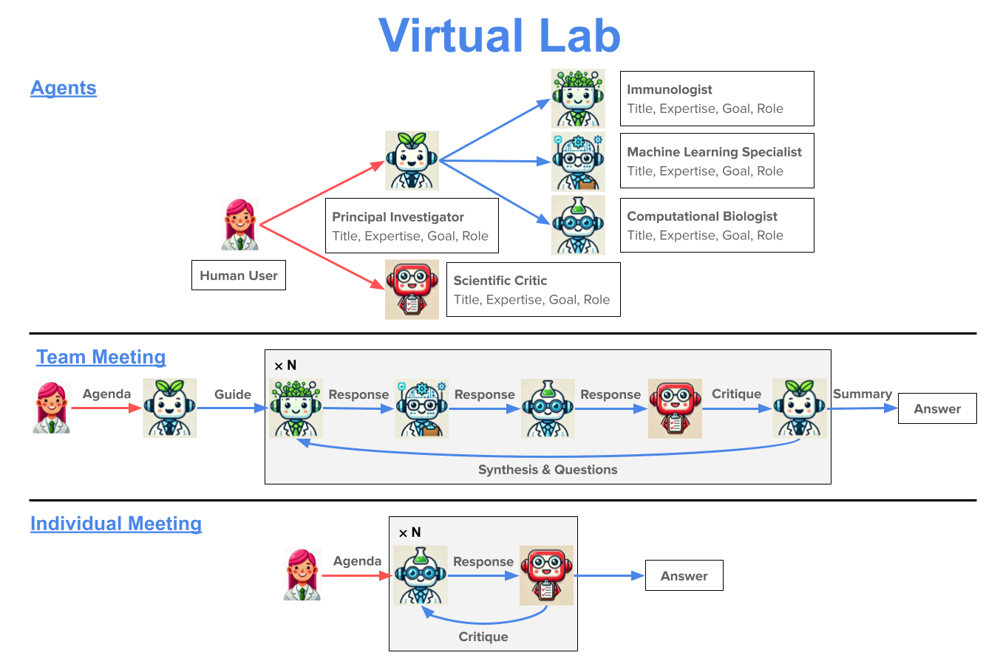

# Virtual Lab

> A Python framework for human-AI collaborative scientific research — applied to designing SARS-CoV-2 nanobodies published in *Nature* (2025).

[](https://pypi.org/project/virtual-lab/)
[](https://pypi.org/project/virtual-lab/)
[](LICENSE)
[](https://doi.org/10.1038/s41586-025-09442-9)

---

## Visuals



*Architecture overview: a human researcher directs a team of specialised LLM agents through structured meetings. Agents can call external tools (PubMed search, Data Lake queries) during discussions.*

---

## Overview & Motivation

Scientific research requires synthesising expertise across immunology, machine learning, structural biology, and computational chemistry — a breadth that no single researcher can cover alone. The Virtual Lab addresses this by assembling a team of LLM agents, each with a defined persona and role, that debate and refine research plans under human guidance.

This fork of [zou-group/virtual-lab](https://github.com/zou-group/virtual-lab) extends the framework in two directions:

1. **Multi-provider LLM support** — switch between OpenAI, OpenRouter, and BigModel (GLM-4-Flash, free tier) by changing a single variable in `config.py`.
2. **Materials Science Data Integration** — a fully functional ETL pipeline ingesting PubChem, Materials Project, HydrogelDB, MatWeb, MatPortal, and ChEBI data into a local Data Lake, with agent tool wrappers that let agents query it mid-meeting.

The primary case study — designing 92 experimentally validated SARS-CoV-2 nanobodies — was published in *Nature* (2025):

> Swanson, K., Wu, W., Bulaong, N.L. et al. **The Virtual Lab of AI agents designs new SARS-CoV-2 nanobodies.** *Nature* (2025). https://doi.org/10.1038/s41586-025-09442-9

---

## Features

### Core Framework
- **Team meetings** — multi-agent roundtables with a Principal Investigator leading N rounds of debate, synthesis, and a structured final summary.
- **Individual meetings** — 1-on-1 sessions between a specialist agent and a Scientific Critic for iterative refinement.
- **PubMed tool use** — agents can search PubMed Central and retrieve full article text during discussions.
- **Structured prompt system** — agenda, questions, rules, prior summaries, and background context are all first-class parameters.
- **Cost tracking** — input/output token counts and estimated USD cost logged after every meeting.
- **Transcript persistence** — every meeting saved as both JSON (for downstream use) and Markdown (for human review).

### Data Integration (this fork)
- **6 database integrations** — PubChem, Materials Project, HydrogelDB, MatWeb, MatPortal, ChEBI via REST APIs and web scraping.
- **2 CSV data sources** — 3D Bioprinting Data Hub and Signaling Pathways Project.
- **Data Lake ETL** — raw timestamped dumps → cleaned, normalised DataFrames in `data_lake/processed/`.
- **Agent tool wrappers** — `search_bioprinting_params()` and `suggest_hydrogel()` turn Data Lake queries into natural-language agent responses.

### Nanobody Design Case Study
- **4-round design loop** — ESM → AlphaFold-Multimer → Rosetta scoring, iterated 4 times.
- **4 nanobody scaffolds** — Ty1, H11-D4, Nb21, VHH-72, optimised for the SARS-CoV-2 KP.3 variant.
- **92 experimentally validated candidates** — tested by ELISA against Wuhan, JN.1, KP.3, KP2.3, and BA.2 spike RBD strains.

---

## Tech Stack

| Category | Technology |
|----------|-----------|
| Language | Python 3.10–3.13 |
| LLM APIs | OpenAI Assistants API, OpenRouter, BigModel (GLM-4-Flash) |
| Protein ML | ESM (Meta), AlphaFold-Multimer (LocalColabFold) |
| Structural scoring | Rosetta |
| Token accounting | tiktoken |
| Data | pandas, biopython, seaborn |
| Materials APIs | mp-api (Materials Project), pubchempy (PubChem) |
| Web scraping | beautifulsoup4 |
| Build | hatchling |
| Notebooks | Jupyter |

---

## Architecture Overview

Virtual Lab has two loosely-coupled layers:

**Layer 1 — Meeting Orchestration**

```
Human Researcher → run_meeting(agenda, agents) → OpenAI Assistants API
  ├─ Team meetings:      PI + specialist agents share one Thread
  └─ Individual meetings: Specialist ↔ Scientific Critic
Outputs: JSON + Markdown transcripts
```

**Layer 2 — Data Integration (this fork)**

```
External databases → ETL scripts → data_lake/raw/ → data_lake/processed/
                                                        ↓
                                           Agent tool wrappers (formulation.py)
```

See [`docs/architecture.md`](docs/architecture.md) for the full system diagram and [`docs/decisions.md`](docs/decisions.md) for design rationale.

---

## Installation

```bash
# 1. Create a Python 3.12 environment
conda create -y -n virtual_lab python=3.12
conda activate virtual_lab

# 2. Install the core package
pip install virtual-lab

# 3. (Optional) Nanobody design extras — ESM, AlphaFold, Rosetta utilities
pip install "virtual-lab[nanobody-design]"

# 4. (Optional) Data integration extras — mp-api, pubchempy, beautifulsoup4
pip install "virtual-lab[data-integration]"

# 5. Copy and fill in environment variables
cp .env.example .env
# Edit .env and add your API keys (see .env.example for all options)
```

**LLM provider:** Open `src/virtual_lab/config.py` and set `ACTIVE_PROVIDER` to `"openai"`, `"openrouter"`, or `"bigmodel"`. Ensure the corresponding key is set in `.env`.

**AlphaFold-Multimer (nanobody design only):** Install LocalColabFold separately by following https://github.com/YoshitakaMo/localcolabfold or running `nanobody_design/install_localcolabfold.sh`.

---

## Usage

### Run a team meeting

```python
from pathlib import Path
from virtual_lab import Agent, run_meeting
from virtual_lab.prompts import PRINCIPAL_INVESTIGATOR

immunologist = Agent(
    title="Immunologist",
    expertise="antibody engineering and immune response characterization",
    goal="guide the development of nanobodies with broad variant coverage",
    role="advise on immunogenicity, cross-reactivity, and therapeutic viability",
    model="gpt-4o",
)

summary = run_meeting(
    meeting_type="team",
    agenda="Design a nanobody strategy for the SARS-CoV-2 KP.3 variant.",
    save_dir=Path("discussions/kickoff"),
    team_lead=PRINCIPAL_INVESTIGATOR,
    team_members=(immunologist,),
    num_rounds=2,
    pubmed_search=True,
    return_summary=True,
)
print(summary)
```

### Run the full nanobody design case study

```bash
jupyter notebook nanobody_design/run_nanobody_design.ipynb
```

Then follow the shell commands in [`nanobody_design/workflow.md`](nanobody_design/workflow.md) to run the ESM → AlphaFold-Multimer → Rosetta pipeline.

### Run the data integration pipeline

```bash
# Populate the Data Lake with materials-science data
python -m src.data_integration.main

# Run the formulation agent demo (queries the Data Lake)
python -m src.virtual_lab.formulation_agent_demo
```

---

## Roadmap

- [ ] **Phase 2 — Therapeutic Formulation**: Wire Formulation Scientist, Bio-Manufacturing Engineer, and Toxicologist agents into `run_meeting()`, using the Data Lake as their knowledge source.
- [ ] **`tools/materials_tools.py`**: Implement full material property query wrappers for agent use (analogous to `pubmed_search`).
- [ ] **Vector store**: Replace CSV-based Data Lake lookups with semantic search over a vector database.
- [ ] **FastAPI interface**: Expose the Data Lake as a queryable REST API.
- [ ] **Multi-model cost tracking**: Extend `print_cost_and_time()` to handle meetings where different agents use different models.
- [ ] **NCBI API key support**: Add registered API key option to `run_pubmed_search()` for higher rate limits.

---

## Credits

This repository is a fork of [zou-group/virtual-lab](https://github.com/zou-group/virtual-lab), the original work by the Zou Group at Stanford University. The upstream nanobody design case study and core meeting orchestration framework were created by:

Kyle Swanson, Wenqian Wu, Nicole L. Bulaong, and collaborators.

Original paper: Swanson, K., Wu, W., Bulaong, N.L. et al. *The Virtual Lab of AI agents designs new SARS-CoV-2 nanobodies.* **Nature** (2025). https://doi.org/10.1038/s41586-025-09442-9

**Extensions in this fork** (multi-provider LLM config, data integration layer, formulation agent demo) are original contributions by the repository maintainer.

---

## License

MIT License — see [LICENSE](LICENSE) for details.

If you use this work, please cite the original paper:

```bibtex
@article{swanson2025virtuallab,
  title   = {The Virtual Lab of AI agents designs new SARS-CoV-2 nanobodies},
  author  = {Swanson, Kyle and Wu, Wenqian and Bulaong, Nicole L. and others},
  journal = {Nature},
  year    = {2025},
  doi     = {10.1038/s41586-025-09442-9}
}
```
